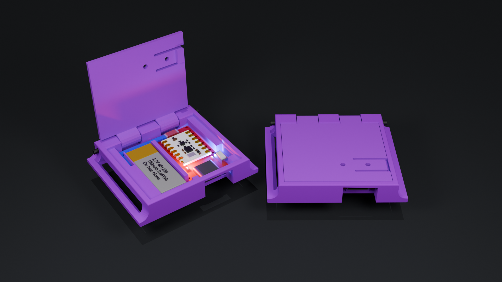

# Smol-Panini-Case
The Smol-Panini-Case is a SlimeVR Smols Case designed to utilise integrated Filament hinge.

	

# REVISION 2.1!
Revision 2.1 brings a slightly larger design in favor for strength and a better lid mechanism
 - Now locks into 90* increments
 - Lid sits flush! (no more getting it snagged!)
 - Matching insides for easy switch!

These cases have some intentionally tight tollerances on the hinges so that they are sufficiently stiff to assist with keeping the lid closed during use.
You can use a 2mm alankey or drill bit to make sure the gap is sufficient.
This case is intended to be used with 30mm straps which you can find [here](https://www.aliexpress.com/item/1005006112175102.html)

Things you will need:

 - Stacked Slime with 601230 180mah battery and button of choice (i used 3X6X2.5 button)
 - Case.stl
 - Lid.stl
 - 40-42mm of filament (per case)
 - Allen key (optional)
 - Something hot (solding iron set to the temp you print at is perfect)
 - Some wire

I would reccomend printing these out of PLA+, PETG or *proper* ABS @ 0.1mm layer height (0.2 is fine but doesnt look as nice).

CHECK YOUR ORIENTATIONS BEFORE PRINTING

After printing out the cases & lids you need: 
simply put the lid and case together.
push your peice of filament though leaving 1-2mm on each end, cut off the extra. (use a small allen key to help line it up if you are struggling)
Next, Using your "something hot" melt and flatten the ends of the extra filament, fusing it to the case
now give it a couple flippy flops opening and closing it.
This will just help loosen it up abit, dont worry about it getting loose too much, if you're opening it often, you're doing something wrong.

If you need some help, feel free to ping me in the #Smol-Slime Channel! @tigsteruk

Thanks go out to: 
 - Emil (Ketzal) for the name idea
 - Meia (KOUNOLAB's #1 employee) for the IMU's
 - Lexie (aka scwanf) for all of the hardwork developing smols and tollerating my harrasment
 - Shine Bright for creating the smol docs and allowing me to RTFM my way through some of this project
 - Lyall (Stacked Slime) for creating this format and providing firmware versions for use
 - The rest of the #Smol-Slime channel for all of the help with understanding how it all works

Hyperion Approved! <3

Strap notes:
For your consideration, I'm a rarther heavy set 5'6 dude, I use these lengths from the strap link above:
Chest, Waist, Hips: 100CM 3x
Thighs: 60cm 2x
Ankles and forearms: 30cm 4x
Upper Arms: 40cm 2x
